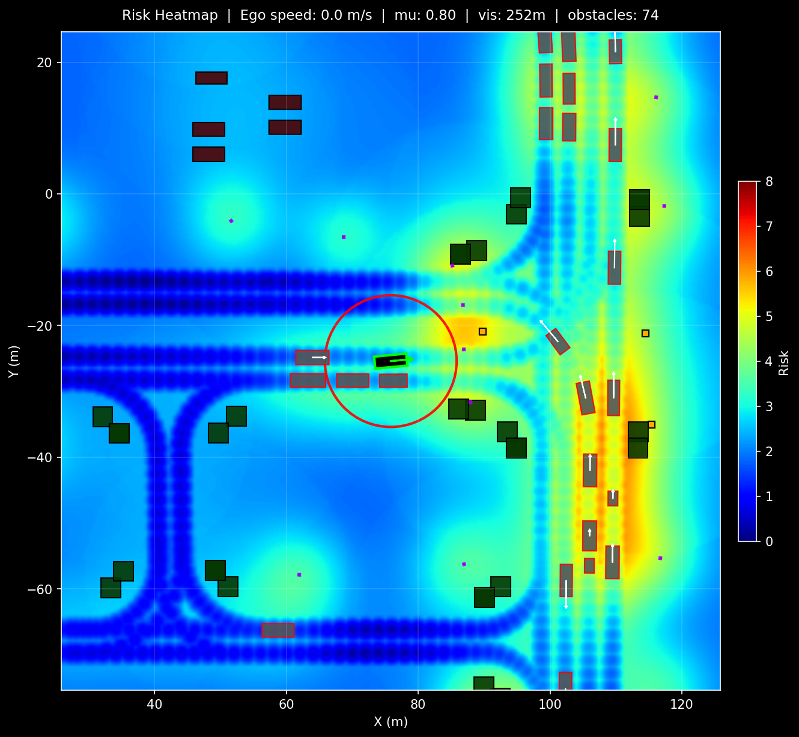
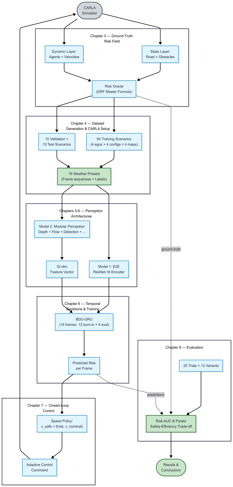
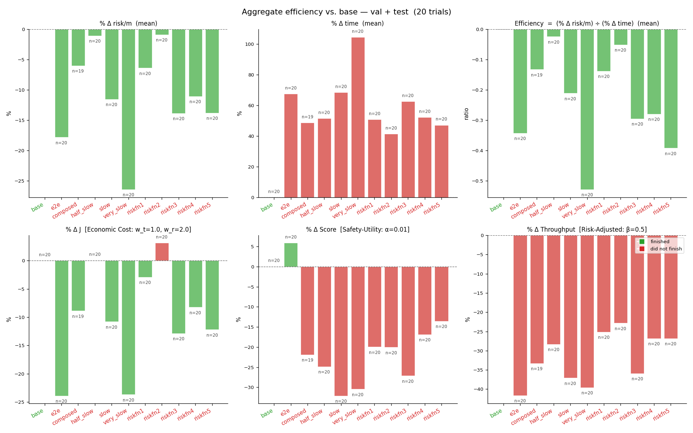
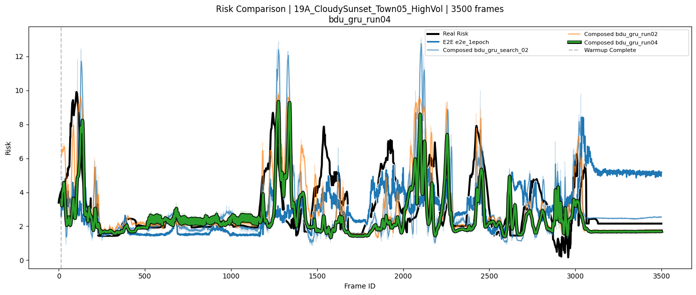
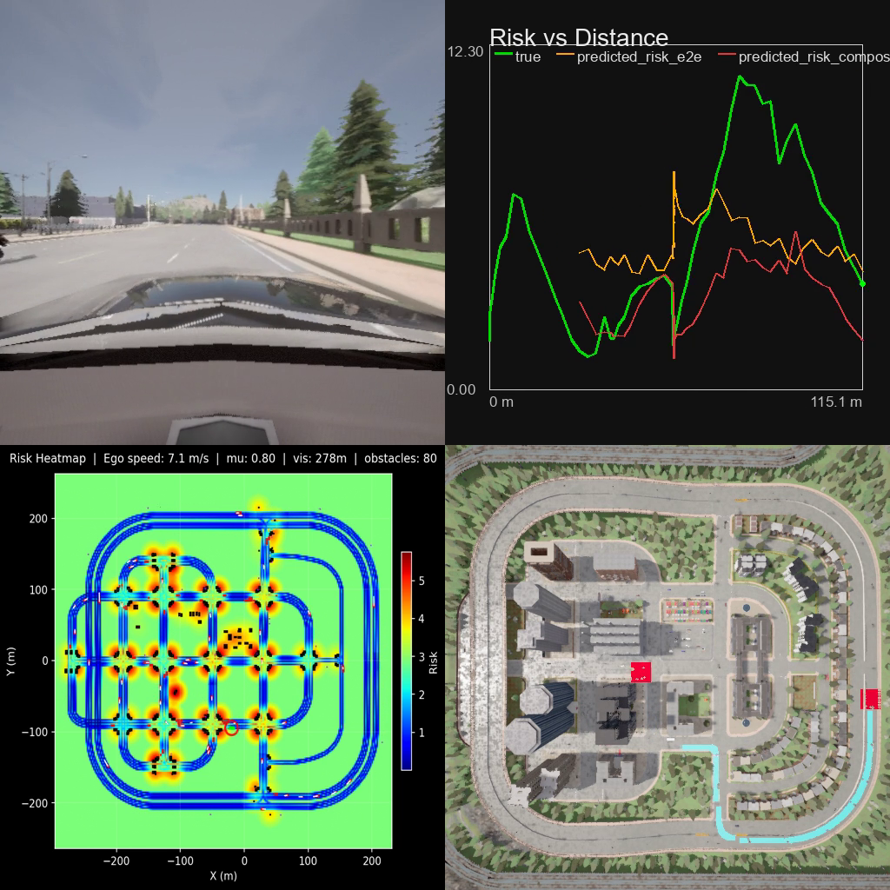

<div align="center">

# MIREIA

### **M**onocular **I**nterpretable **R**isk **E**valuation for **I**ntelligent **A**utonomy

*A monocular, camera-only system that estimates **how dangerous a driving scene is** — and slows the car only when the risk genuinely demands it.*




<sub>The Driving Risk Field rendered live on a CARLA scene — a continuous danger potential over the road plane, built from vehicle dynamics and scene geometry.</sub>

</div>

---

MIREIA turns a **single front-facing camera** into an interpretable, physically-grounded estimate of driving risk, then uses that estimate to drive a **risk-aware speed controller** in closed loop. The whole system — the analytical risk oracle that generates ground-truth labels, two learned risk predictors, the closed-loop trial machinery, and the analysis tooling — is built and validated inside the [CARLA](https://carla.org/) simulator and released here in full.

## Motivation

Autonomous vehicles rarely expose an explicit, interpretable estimate of how dangerous their current situation is, even though such a signal could make their behaviour more transparent and let them slow down only when risk genuinely demands it, rather than slowing uniformly or merely reacting once danger is imminent.

Producing one is hard for two reasons:

- **It must be physically grounded**, not merely asserted.
- **It must be validated against a ground truth** that real driving footage cannot reliably supply.

MIREIA addresses both inside CARLA, where the true scene is known and every quantity is directly observable.

## How It Works

<div align="center">

</div>

The system is a three-stage pipeline:

1. **A Driving Risk Field (DRF) as ground truth.** A continuous potential over the road plane, built from stopping-sight-distance geometry and a *probability × severity* decomposition. Deployed as an automatic labeller, it reads risk directly from the simulator state to produce a reproducible, per-frame ground truth across a suite of replayable scenarios.

2. **Two monocular vision models** that predict this field from a single camera stream:
   - **Model 1 — End-to-end:** a ResNet-18 encoder feeding a shared bidirectional GRU temporal backbone, mapping raw pixels straight to risk.
   - **Model 2 — Modular:** a composition of pre-trained perception specialists (YOLO11 detection, Depth Anything V2, road segmentation, environment classification, phase-correlation ego-motion) distilled into a compact 32-D feature vector feeding the same backbone — cheaper and **interpretable**.

3. **A risk-aware speed policy.** A closed-form law that turns predicted risk into a safer target speed, benchmarked against risk-blind baselines on a safety-versus-efficiency trade-off.

## Results

<div align="center">

<br>
<sub>Each variant as a percentage change against its baseline run, averaged over twenty closed-loop trial slots across two maps.</sub>
</div>

<br>

- **Acting on predicted risk beats driving slower.** A well-tuned risk-aware policy cuts more danger per unit of added travel time than uniform slowing — the trade-off can genuinely be moved.
- **The cheap, interpretable model holds its own.** The modular composition is competitive with the monolithic end-to-end network, while exposing *why* it predicts what it does.
- **Learned predictors close the loop.** Even with no access to the ground-truth field, both models capture the risk spikes well enough to drive the controller past the risk-blind baselines.

<div align="center">

<br>
<sub>Predicted risk (coloured) tracking the ground-truth field (black) on a held-out scenario.</sub>
</div>

## See It Running

<div align="center">

<br>
<sub>A single closed-loop run: in-cabin RGB, the risk-vs-distance trace, the top-down risk heatmap, and the route view.</sub>
</div>

## Quickstart

```bash
# 1. Requirements: Python 3.12 and CARLA 0.9.16 (UE 4.26 build)
pip install -r MIREIA/requirements.txt

# 2. Configure paths (copy and edit)
cp MIREIA/.env.example MIREIA/.env
#   set PATH_TO_SCENARIOS, PATH_TO_TRIALS, PATH_TO_MODELS, CARLA_HOST, CARLA_PORT

# 3. Launch CARLA, then open the numbered notebooks in order.
```

> **Note:** Trained checkpoints and generated datasets are not bundled (size). The notebooks regenerate the datasets from CARLA and retrain the models from scratch.

## Notebooks

The 15 workflow notebooks at the repository root follow the pipeline stage by stage: **data → validation → perception → training → inference → trials → analysis.**

<details>
<summary><b>Full notebook index</b></summary>

| # | Notebook | Stage | Purpose |
|---|----------|-------|---------|
| 01 | [`NB_01_scenario_demo`](NB_01_scenario_demo.ipynb) | Data | Build a `Scenario`, run it synchronously, capture an RGB + ground-truth-risk dataset. |
| 02 | [`NB_02_risk_field_validation`](NB_02_risk_field_validation.ipynb) | Validation | Drive the `RiskOracle` against a live world and render top-down DRF heatmaps. |
| 03 | [`NB_03_perception_modules_demo`](NB_03_perception_modules_demo.ipynb) | Perception | Single-frame demo of every perception module. |
| 04 | [`NB_04_training_pipeline`](NB_04_training_pipeline.ipynb) | Training | Full training driver: Climate → E2E → RoadSeg → Speed fusion → Dataset labelling → BDU-GRU search. |
| 05 | [`NB_05_feature_analysis`](NB_05_feature_analysis.ipynb) | Analysis | PCA, clustering, and correlation diagnostics of the 32-D feature space. |
| 06 | [`NB_06_queued_inference_demo`](NB_06_queued_inference_demo.ipynb) | Inference | Offline replay: E2E vs Composed model overlaid on ground-truth risk. |
| 07 | [`NB_07_composed_inference_analysis`](NB_07_composed_inference_analysis.ipynb) | Inference | Per-stage timing, call-count profiling, FPS comparison. |
| 08 | [`NB_08_trial_builder`](NB_08_trial_builder.ipynb) | Trials | Author and persist `TrialDefinition` objects with an interactive waypoint picker. |
| 09 | [`NB_09_trial_demo`](NB_09_trial_demo.ipynb) | Trials | Single live trial run with baseline + streaming-predictor variants. |
| 10 | [`NB_10_trial_batch_runner`](NB_10_trial_batch_runner.ipynb) | Trials | Sweep: `base` subtrial per trial. |
| 11 | [`NB_11_trial_slow_batch_runner`](NB_11_trial_slow_batch_runner.ipynb) | Trials | Sweep: `slow` subtrial with a constant speed multiplier. |
| 12 | [`NB_12_trial_function_batch_runner`](NB_12_trial_function_batch_runner.ipynb) | Trials | Sweep: oracle-in-the-loop risk-aware speed control. |
| 13 | [`NB_13_trial_models_batch_runner`](NB_13_trial_models_batch_runner.ipynb) | Trials | Sweep: per-model risk-aware speed control (headline closed-loop result). |
| 14 | [`NB_14_trial_analysis`](NB_14_trial_analysis.ipynb) | Analysis | Per-run visualisation: compile videos and plot the per-tick risk trace. |
| 15 | [`NB_15_trial_comparison`](NB_15_trial_comparison.ipynb) | Analysis | Aggregate validation / test comparison: tables, route plots, efficiency charts. |

Each notebook opens with a header cell stating its purpose, inputs, outputs, and place in the workflow. The `test_dashcam/` folder holds two real-dashcam preprocessing / inference notebooks that live outside the main pipeline.

</details>

## Repository Layout

| Path | Contents |
|------|----------|
| [`MIREIA/`](MIREIA/README.MD) | The Python package: `core` (DRF physics), `perception` (models + integrator), `simulation` (CARLA bridge), `data_collection`, `analysis`, `models`. |
| `NB_*.ipynb` | The 15 workflow notebooks above. |
| [`test_dashcam/`](test_dashcam/) | Real dashcam preprocessing and inference notebooks (out-of-distribution check). |
| [`tfg/`](tfg/) | The thesis source (`main.tex`, `refs.bib`, diagrams). |
| [`PythonAPI/`](PythonAPI/) | CARLA Python API utilities and examples. |

See [`MIREIA/README.MD`](MIREIA/README.MD) for the architecture diagram, per-subpackage documentation, and the scenario / trial dataset layout.

## Built With

CARLA · Python 3.12 · PyTorch · YOLO11 (Ultralytics) · Depth Anything V2 · Segment Anything 2 · OpenCV · scikit-learn

## License

Released under the **GNU Affero General Public License v3.0** (see [`LICENSE`](LICENSE)). Free to use, study, and modify for research and academic purposes; any distributed or network-deployed derivative must in turn be made available under the same license, so it cannot be folded into closed-source software. The bundled CARLA simulator and its `PythonAPI/` are covered by their own MIT license.

---

<div align="center">
<sub>Bachelor's Thesis (TFG) · Facultat d'Informàtica de Barcelona, Universitat Politècnica de Catalunya · Miquel Rodríguez Sansaloni</sub>
</div>
